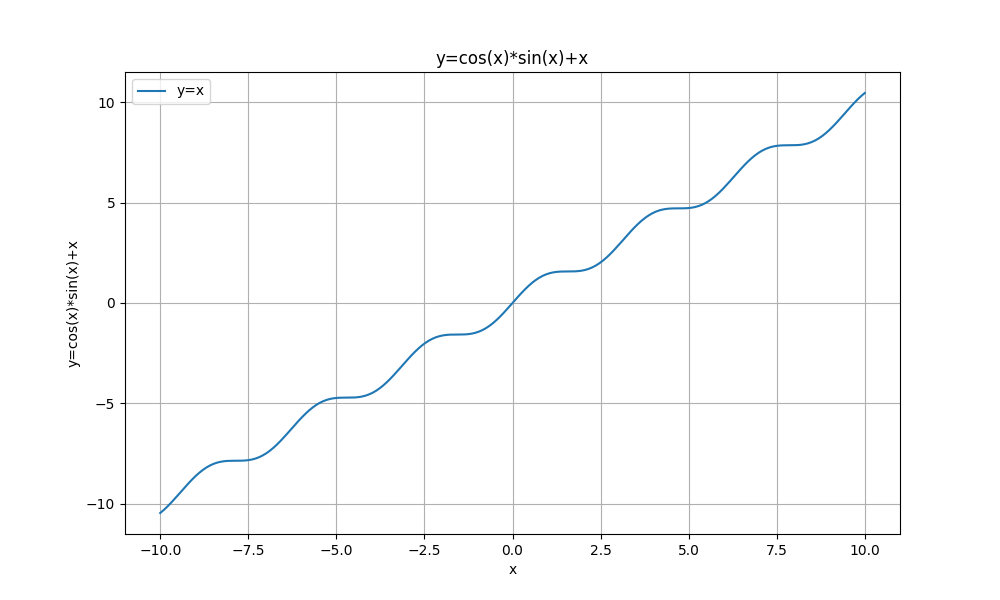
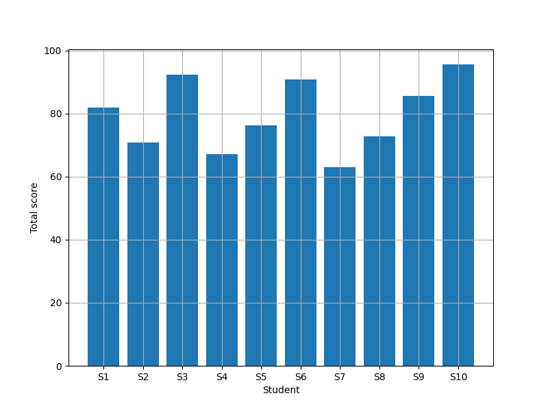

## 1. Project Title

**Mathematical Functions and Data Analysis with Python**

## 2. Short Project Description

This project shows the visualization of the math function.

## 3. Libraries Used

*   **NumPy**: For mathematical functions and array functions.
*   **Matplotlib**: For creating visualizations.
*   **math**: For basic mathematical operations. But not used in the code.

## 4. How to Run the Code

1. open the math_visualization.ipynb
2. Run the codes
   
## 5. Screenshots of at least two generated graphs

### Own_equation

### score_histogram

## 6. Short Explanation

*   **How does visualization help us understand mathematical functions and data?**
    It is hard to see the feature of numbers by the raw. But if you draw the graph then you can easily see the connection of the data.

*   **Which plot was most useful in this assignment and why?**
    Own_equation.png was the most useful. Because this graph shows all the shape of my graph. So I can easily see the shape of my own equation easily.

*   **What is the role of NumPy and Matplotlib in your project?**
    **NumPy** enables to make array and cos,sin functions.
    **Matplotlib** enables to draw the plots.
